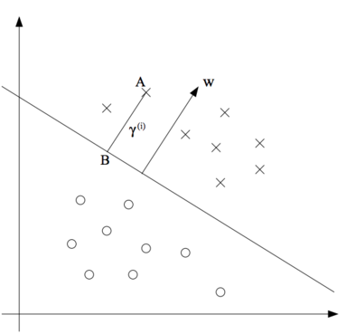

# Support Vector Machines

## Classification
### Model
#### High Level Idea of SVMs
**Functional Margin**
<br></br>
Definition:
$$\hat \gamma^{(i)} = y^{(i)}(w^Tx + b)$$
Some Observations:  

* If $y^{(i)} = 1$, the larger $w^Tx + b$ is, the larger the functional margin will be.  
* The value of $\hat \gamma$ is affected by the scale of $w$ and $b$; therefore, it is reasonable to introduce normalization.

Functional Margin for a dataset with $m$ instances:
$$\hat \gamma = \min_{i=1,...,m} \hat \gamma^{(i)}$$
**Geometric Margin**
<br></br>
  
Geometric Margin
(Original Graph: <http://cs229.stanford.edu/notes/cs229-notes3.pdf>)

$$\gamma^{(i)} = \frac{w^Tx^{(i)} + b}{\Vert w \Vert} = \left(\frac{w}{\Vert w \Vert} \right)^T x^{(i)} + \frac{b}{\Vert w \Vert}$$

Define the geometric margin of ($w$, $b$) with respect to a training example ($x^{(i)}$, $y^{(i)}$):
$$\gamma^{(i)} = y^{(i)}\left(\left(\frac{w}{\Vert w \Vert}\right)^Tx^{(i)} + \frac{b}{\Vert w \Vert}\right)$$

Geometric Margin for a dataset with $m$ instances:
$$\gamma = \min_{i=1,...,m} \gamma^{(i)}$$

**Training**
<br></br>
To train SVM, it is equivalent to find a hyperplane that can achieves the maximum geometric margin

\begin{equation*}
\begin{aligned}
& \underset{\gamma, w, b}{\text{maximize}}
& & \gamma \\
& \text{s.t.}
& & y^{(i)}(w^Tx^{(i)} + b) \geqslant \gamma\text{, } i=1,...,m, \\
&&& \Vert w \Vert = 1.
\end{aligned}
\end{equation*}

Since "$\Vert w \Vert = 1$" is a non-convex constraint, transform the problem into the following:

\begin{equation*}
\begin{aligned}
& \underset{\gamma, w, b}{\text{maximize}}
& & \frac{\hat \gamma}{\Vert w \Vert} \\
& \text{s.t.}
& & y^{(i)}(w^Tx^{(i)} + b) \geqslant \hat \gamma\text{, } i=1,...,m, \\
\end{aligned}
\end{equation*}

Introduce the scaling constraint that the functional margin of $w, b$ with respect to the training set must be 1. That is, $\hat \gamma = 1$. The problem has become a convex quadratic objective with linear constraints and its solution gives use the optimal margin classifier.

\begin{equation*}
\begin{aligned}
& \underset{\gamma, w, b}{\text{minimize}}
& & \frac{1}{2}\Vert w \Vert^2 \\
& \text{s.t.}
& & y^{(i)}(w^Tx^{(i)} + b) \geqslant 1 \text{, } i=1,...,m, \\
\end{aligned}
\end{equation*}

The dual problem that used for Kernel tricks

\begin{equation*}
\begin{aligned}
& \underset{\alpha}{\text{minimize}}
& & \sum_{i=1}^m \alpha^{(i)} - \frac{1}{2} \sum_{i=1}^m \sum_{j=1}^m \alpha^{(i)} \alpha^{(j)} y^{(i)} y^{(j)} {\mathbf x^{(i)}}^T \mathbf x^{(j)}\\
& \text{s.t.}
& & \alpha^{(i)} \geqslant 0 \text{, } i=1,...,m, \\
\end{aligned}
\end{equation*}

For soft margin classification:

\begin{equation*}
\begin{aligned}
& \underset{\gamma, w, b}{\text{minimize}}
& & \frac{1}{2}\Vert w \Vert^2 + C \sum_{i=1}^m \zeta^{(i)}\\
& \text{s.t.}
& & y^{(i)}(w^Tx^{(i)} + b) \geqslant 1 \text{, } i=1,...,m, \\
& & & \zeta^{(i)} \text{, } i=1,...,m,
\end{aligned}
\end{equation*}


#### Linear models
* **Hard Margin**: Strictly enforce that all instances must be off the margin and on the right sides.
    * only works for linear separable datasets
    * sensitive to outliers
* **Soft Margin**: Relax the restriction of hart margin model.
    * In Scikit-Learn's SVM classes, hyperparameter C is used to control the flexibility. A smaller C leads to a wider margin but more margin violations

```python
from sklearn.pipeline import pipeline
from sklearn.preprocessing import StandardScaler
from sklearn.svm import LinearSVC


svm_clf = Pipeline([
            ('scaler', StandardScaler()),
            ('linear_svc', LinearSVC(C=1, loss='hinge')),
        ])
svm_clf.fit(X_train, Y_train)
```

#### Non-linear models  

In the dual form optimization problem above, ${\mathbf x^{(i)}}^T \mathbf x^{(j)}$ can be replaced with $K(\mathbf a, \mathbf b)$

* Polynomial Kernel
$$K(\mathbf a, \mathbf b) = {(\gamma \mathbf a^T \cdot \mathbf b + r)}^d$$

```python
from sklearn.pipeline import pipeline
from sklearn.preprocessing import StandardScaler
from sklearn.svm import SVC


poly_kernel_svm_clf = Pipeline([
            ('scaler', StandardScaler()),
            ('poly_svc', SVC(kernel='poly', degree=3, coef0=3, C=5)),
        ])
poly_kernel_svm_clf.fit(X_train, Y_train)
```

* Gaussian RBF Kernel
$$K(\mathbf a, \mathbf b) = exp(-\gamma \Vert \mathbf a - \mathbf b \Vert^2)$$

```python
from sklearn.pipeline import pipeline
from sklearn.preprocessing import StandardScaler
from sklearn.svm import SVC


rbf_kernel_svm_clf = Pipeline([
            ('scaler', StandardScaler()),
            ('rbf_svc', SVC(kernel='rbf', gamma=5, C=0.001)),
        ])
rbf_kernel_svm_clf.fit(X_train, Y_train)
```

* Sigmoid
$$K(\mathbf a, \mathbf b) = tanh(\gamma \mathbf a^T \cdot \mathbf b + r)$$

```python
from sklearn.pipeline import pipeline
from sklearn.preprocessing import StandardScaler
from sklearn.svm import SVC


sigmoid_kernel_svm_clf = Pipeline([
            ('scaler', StandardScaler()),
            ('sigmoid_svc', SVC(kernel='sigmoid')),
        ])
sigmoid_kernel_svm_clf.fit(X_train, Y_train)
```

## Regression
### Model
In an SVM regression problem, a model tries to keep as many points as possible inside a margin $\epsilon$.
### Training
The optimization problem for SVM regression is the following:


\begin{equation*}
\begin{aligned}
& \underset{w, b}{\text{maximize}}
& & \frac{1}{2}\Vert w \Vert^2 \\
& \text{s.t.}
& & y^{(i)} - (w^Tx^{(i)} + b) \leqslant \epsilon \text{, } i=1,...,m, \\
& & &(w^Tx^{(i)} + b) - y^{(i)} \leqslant \epsilon \text{, } i=1,...,m, \\
\end{aligned}
\end{equation*}

To allow some points to be outside the margin, the optimization problem becomes:


\begin{equation*}
\begin{aligned}
& \underset{w, b}{\text{maximize}}
& & \frac{1}{2}\Vert w \Vert^2 + C\sum_{i=1}^m (\zeta^{(i)} + {\zeta^{(i)}}^{*}) \\
& \text{s.t.}
& & y^{(i)} - (w^Tx^{(i)} + b) \leqslant \epsilon + \zeta^{(i)} \text{, } i=1,...,m, \\
& & &(w^Tx^{(i)} + b) - y^{(i)} \leqslant \epsilon + {\zeta^{(i)}}^{*} \text{, } i=1,...,m, \\
& & & \zeta^{(i)}, {\zeta^{(i)}}^{*} \geqslant 0
\end{aligned}
\end{equation*}


### Code
```python
from sklearn import LinearSVR


svm_reg = LinearSVR(epsilon=1.5)
svm_reg.fit(X_train, Y_train)
```

```python
from sklearn import SVR


svm_reg = SVR(kernel='poly', degree=2, c=100, epsilon=0.5)
svm_reg.fit(X_train, Y_train)
```
